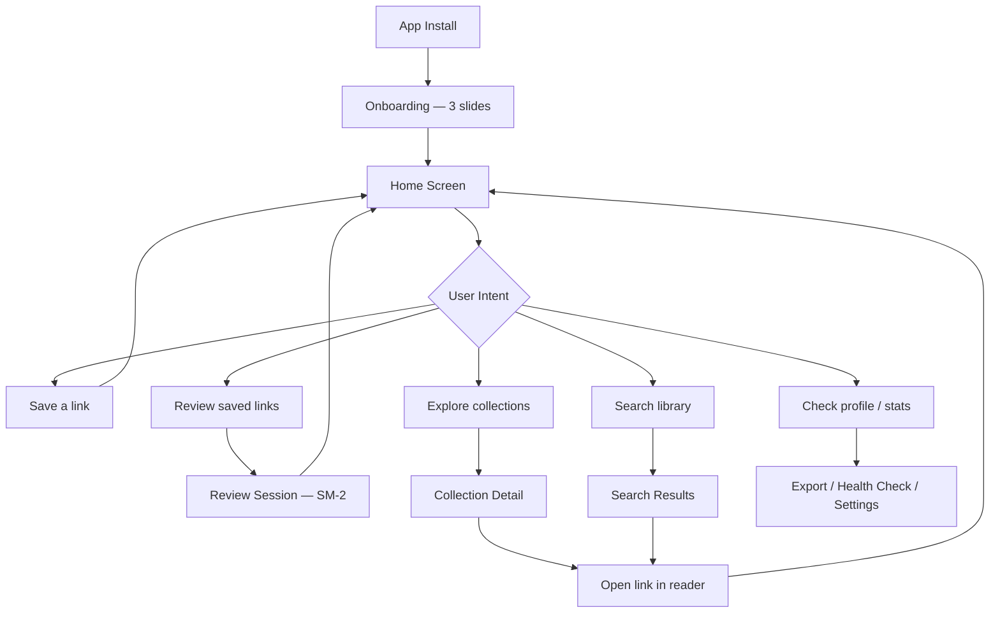
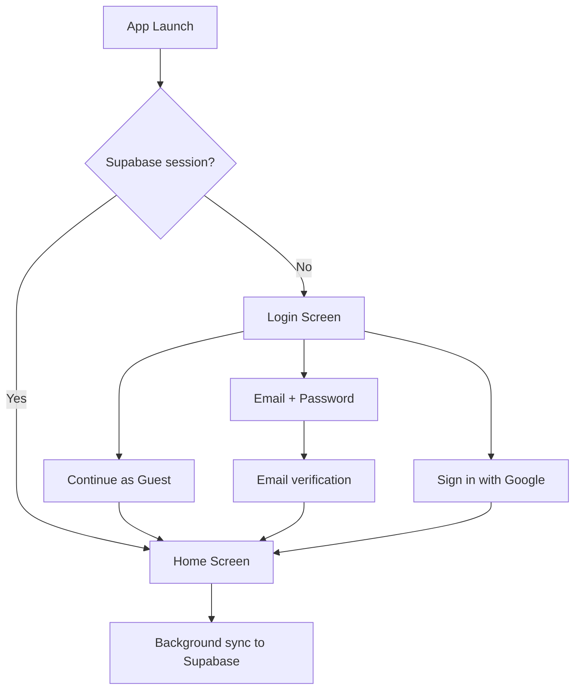
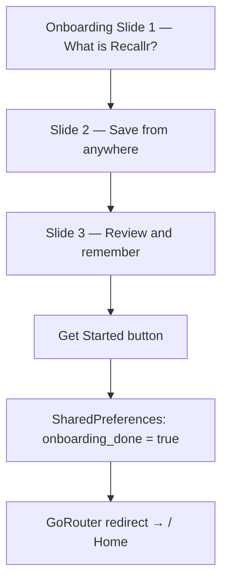

# Recallr — Complete Project Documentation

> Generated: 2026-06-11 | Last updated: 2026-06-30 | Flutter 3.41.6 | Riverpod + Isar + GoRouter + Firebase | Clean Architecture + Feature First

---

# 1. Product Requirements Document (PRD)

## 1.1 Project Overview

**Recallr** is an offline-first, mobile link-saving and spaced-repetition app built in Flutter. Users save URLs from any app via the system share sheet, and Recallr enriches them with metadata (title, description, favicon, OG image), organises them into tags and collections, and surfaces forgotten links via a SM-2-based review queue and a "Remember This?" discovery card.

---

## 1.2 Problem Statement

Knowledge workers save dozens of links weekly but retain almost none of them. Browser bookmarks have no recall loop, read-later apps lack active review, and note-taking tools have too much friction for casual link saving. The result: a bookmark graveyard.

Recallr solves three compounding problems:

| Problem | Current Pain | Recallr Solution |
|---|---|---|
| Capture friction | Too many taps to save a link | Share-sheet intent + auto metadata fetch |
| Organisation chaos | Flat list, no meaningful structure | Tags + collections with color/icon |
| Zero retention | Links saved, never revisited | SM-2 spaced repetition review queue |

---

## 1.3 Business Goals

1. Reach 10,000 MAU within 6 months of App Store / Play Store launch.
2. Achieve 40%+ Day-7 retention through the review loop.
3. Grow organic virality via JSON/CSV export shared as "my reading list".
4. Establish a foundation for a Supabase-powered web sync tier (future paid feature).

---

## 1.4 Success Metrics

| Metric | Target (Month 3) | Measurement |
|---|---|---|
| DAU/MAU ratio | ≥ 30% | Analytics events |
| Links saved per user/week | ≥ 5 | Isar write count |
| Review completion rate | ≥ 50% of due cards | SM-2 quality recorded |
| Reading streak ≥ 3 days | ≥ 25% of active users | Streak provider |
| App crash-free sessions | ≥ 99.5% | Crashlytics |
| Link health check usage | ≥ 15% of users | SharedPreferences flag |

---

## 1.5 Target Audience

**Primary:** Knowledge workers, researchers, developers, students — people who read and save links continuously (25–40 years old, tech-comfortable).

**Secondary:** Casual readers who want a cleaner "read later" than browser bookmarks.

---

## 1.6 User Personas

### Persona A — "The Researcher" (Aarav, 28, software engineer)
- Saves 10–20 links/day from Twitter, Hacker News, newsletters.
- Uses folders/tags heavily. Wants to recall articles during code reviews.
- Pain: "I saved it somewhere but can't find it."
- Goal: Tagged collections + a review queue that surfaces the right link at the right time.

### Persona B — "The Casual Reader" (Priya, 34, product manager)
- Saves 3–5 links/week. Mostly long-form articles.
- Needs zero-friction capture and simple "read next" suggestions.
- Pain: "I save things and forget they exist."
- Goal: Discover card + reading streak to build a habit.

### Persona C — "The Archivist" (Sam, 22, grad student)
- Saves academic papers, course resources, reference links.
- Wants export for backup and portability.
- Pain: "I don't trust cloud-only tools with my research library."
- Goal: Offline-first with JSON/CSV export.

---

## 1.7 Core Features (MVP — Currently Built)

| # | Feature | Status |
|---|---|---|
| 1 | Share-sheet link capture with metadata fetch | ✅ Built |
| 2 | Home feed with recent saves (animated cards) | ✅ Built |
| 3 | In-app reader (WebView) with highlights | ✅ Built |
| 4 | Search with Unread / Favorites / Sort filters | ✅ Built |
| 5 | Tags / Categories with color + icon + rename + delete | ✅ Built |
| 6 | Collections (Folders) with color + icon + rename + delete | ✅ Built |
| 7 | Discover Mode ("Remember This?") | ✅ Built |
| 8 | SM-2 Spaced Repetition Review Queue (4 quality levels) | ✅ Built |
| 9 | SM-2 state persisted in Isar (survives reinstall + export) | ✅ Built |
| 10 | Reading Streak tracking | ✅ Built |
| 11 | Reading Time estimate badge | ✅ Built |
| 12 | Swipe-to-favorite on home feed | ✅ Built |
| 13 | Link options sheet (edit, open, copy, delete, favorite, read) | ✅ Built |
| 14 | Edit Link sheet (title, notes, tags, folder) | ✅ Built |
| 15 | Link Health Checker (HEAD/GET HTTP probe + broken-link badge on card) | ✅ Built |
| 16 | JSON + CSV export (includes SM-2 state, highlights, collections) | ✅ Built |
| 17 | Backup / Restore (auto-backup on startup + manual restore from Profile) | ✅ Built |
| 18 | Spaced-repetition push notifications (daily, reschedules after session) | ✅ Built |
| 19 | Dark / Light theme with AppColorScheme tokens | ✅ Built |
| 20 | Onboarding flow (gated, shown once) | ✅ Built |
| 21 | All-Links library screen with list/grid toggle | ✅ Built |
| 22 | Profile screen with stats + 7-day activity chart | ✅ Built |
| 23 | Firebase Crashlytics (Flutter + Dart async error capture) | ✅ Built |
| 24 | Native splash screen (flutter_native_splash) | ✅ Built |

---

## 1.8 Future Features (Roadmap)

| Priority | Feature | Notes |
|---|---|---|
| P0 | Supabase cloud sync | Links accessible on web; agreed architecture |
| P1 | AI auto-tagging via Claude API | claude-haiku-4-5 for speed + cost |
| P1 | Full-text search (Isar trigram index) | Replace title-only search |
| P2 | Flutter Web companion | Browse synced links in browser |
| P2 | Browser extension (Chrome/Safari) | One-click save from desktop |
| P3 | Public reading lists (shareable URL) | Growth / virality vector |
| P3 | Collaborative collections | Share a folder with another user |
| P4 | RSS / newsletter import | Auto-save from feeds |

---

## 1.9 User Stories

| ID | As a… | I want to… | So that… |
|---|---|---|---|
| US-01 | User | Share a URL from any app into Recallr | I can save it in one tap without opening Recallr first |
| US-02 | User | See auto-fetched title, description, favicon | I don't have to manually label every link |
| US-03 | User | Assign tags and a folder when saving | Links are organised from the start |
| US-04 | User | Swipe a card left to reveal the favorite action | I can favorite quickly without entering a menu |
| US-05 | User | Open a link in the built-in reader | I stay in Recallr and my read status updates |
| US-06 | User | See a "Remember This?" card | I rediscover links I forgot about |
| US-07 | User | Complete a review session (SM-2) | I actually retain what I save |
| US-08 | User | Search by keyword and filter by Unread/Favorites | I can find any link instantly |
| US-09 | User | Create a collection with a custom icon and color | My library has clear visual groupings |
| US-10 | User | Export my library as JSON or CSV | I have a portable backup |
| US-11 | User | See my reading streak | I feel motivated to open links daily |
| US-12 | User | Check if a saved link is still alive | I know which links have gone 404 |
| US-13 | User | Edit the title, notes, tags, and folder of a link | I can clean up auto-fetched metadata |
| US-14 | User | Receive a daily notification when reviews are due | I don't forget to review |

---

## 1.10 Functional Requirements

### Link Management
- FR-01: App must parse incoming share intents on iOS and Android and pre-fill the save sheet.
- FR-02: On save, the app must fetch OG metadata (title, description, thumbnail, favicon, domain) via `metadata_fetch`.
- FR-03: URL must be unique; saving a duplicate must update the existing record, not create a new one.
- FR-04: Links must be editable (title, notes, tags, folder) at any time.
- FR-05: Link deletion must require confirmation; SM-2 data is stored on the `LinkModel` record and is automatically removed with it.

### Organisation
- FR-06: Tags have a unique name, optional colorHex, optional icon string, and isDefault flag.
- FR-07: Collections (FolderModel) have a unique name, optional colorHex, optional icon, sortOrder.
- FR-08: A link may belong to one folder but many tags.

### Discovery & Review
- FR-09: Discover card must show a random unread link saved more than 7 days ago.
- FR-10: Review queue implements SM-2: quality ratings 1 (Forgot), 3 (Hard), 4 (Good), 5 (Easy). All four buttons are present in the review UI.
- FR-10a: After a review session completes, the daily notification must be rescheduled with the updated due count.
- FR-11: Review due count must be computed at app launch and streamed reactively.

### Notifications
- FR-12: A daily 10 AM notification must fire when review queue is non-empty.
- FR-13: Notifications must be toggleable from the Profile screen.

### Export
- FR-14: JSON export must include all link fields plus tag names and folder name.
- FR-15: CSV export must produce a valid RFC 4180 file shareable via system share sheet.

### Link Health
- FR-16: Health check must send HEAD then GET if HEAD fails; result cached in SharedPreferences with a TTL of 24 hours.
- FR-17: Broken links must show a `link_off` icon in the card footer. Status is loaded from SharedPreferences cache on card render; only shown when result is definitively `false`.
- FR-18: Users must be able to trigger a manual restore from the auto-backup file via a button in Profile → Data section, with a confirmation dialog before overwriting.

---

## 1.11 Non-Functional Requirements

| Category | Requirement |
|---|---|
| Performance | Home feed must render first frame < 400 ms on mid-range device |
| Offline | All read/write operations must work with no network; only metadata fetch requires connectivity |
| Storage | Isar DB must not exceed 50 MB for typical usage (10,000 links) |
| Battery | Background tasks must not drain > 1% per hour |
| Accessibility | All interactive elements must have semantic labels; minimum touch target 44×44 dp |
| Security | No sensitive data stored in plaintext outside Isar; SharedPreferences values are non-sensitive |
| Compatibility | Android API 21+; iOS 13+ |

---

## 1.12 Assumptions

- Users will grant notification permission when prompted.
- `metadata_fetch` successfully resolves OG metadata for > 80% of consumer URLs.
- SM-2 state is stored directly on `LinkModel` in Isar. A one-time `Sm2MigrationService` runs on the first launch of v1.0+ to carry any data from the old SharedPreferences format.
- Supabase sync is Phase 2; the current Isar schema is the source of truth.

---

## 1.13 Constraints

- Flutter 3.x (Dart SDK ^3.10.4).
- Isar 3.1 (no migration API — schema changes require careful version management).
- No AI features in current MVP (Claude API integration is Phase 2).
- App Store / Play Store review policies govern notification usage.

---

## 1.14 Risks

| Risk | Likelihood | Impact | Mitigation |
|---|---|---|---|
| `metadata_fetch` fails for paywalled / JS-rendered pages | High | Medium | Show URL-only fallback; let user edit title manually |
| Isar schema migration breaks existing installs | Medium | High | Version Isar schema carefully; write migration tests before any field change |
| SM-2 data loss on app reinstall | Low | Medium | **Resolved** — SM-2 fields are on `LinkModel` in Isar; included in backup/export/restore |
| Share intent URL arrives before Isar initialises | Low | High | `pendingSharedUrl` global holds URL until `MainNavigation` first frame |
| App Store rejection for background notification abuse | Low | High | Notifications are user-toggleable; daily max = 1 |

---

## 1.15 Acceptance Criteria

| AC | Description | Pass Condition |
|---|---|---|
| AC-01 | Share intent capture | Sharing a URL from Chrome pre-fills the save sheet within 2 seconds |
| AC-02 | Metadata fetch | Title and favicon visible on saved card for standard URLs |
| AC-03 | Offline save | Link saves successfully with no network connection |
| AC-04 | Review queue | SM-2 intervals advance correctly: 1 → 6 → ~15 days for Good quality |
| AC-05 | Export JSON | Exported file parses as valid JSON with all fields |
| AC-06 | Health check | 404 URL shows warning badge; 200 URL shows no badge |
| AC-07 | Streak | Opening a link increments streak; missing a day resets it |
| AC-08 | Dark mode | All screens render correctly in both light and dark themes |

---

---

# 2. User Flow Documentation

## 2.1 High-Level User Journey



---

## 2.2 Detailed User Flow

```mermaid
flowchart TD
    subgraph LAUNCH
        S[Splash / main.dart]
        S --> OB_CHK{onboardingDone?}
        OB_CHK -- No --> OB[Onboarding Screen]
        OB_CHK -- Yes --> HOME[Home Screen /]
        OB --> HOME
    end

    subgraph HOME_FLOW[Home]
        HOME --> FAB[FAB tap → Save Sheet]
        HOME --> DISC[Discover Card → Reader]
        HOME --> NEXT[Next Read Card → Reader]
        HOME --> REV_BANNER[Review Banner → /review]
        HOME --> COL_STRIP[Collection chip → /collections/:id]
        HOME --> RECENT[Link card tap → /reader]
        HOME --> SWIPE[Swipe right → toggle favorite]
        HOME --> DOTS[Three-dots → Link Options Sheet]
    end

    subgraph SAVE_FLOW[Save Link]
        FAB --> SAVE_SHEET[Save Sheet bottom modal]
        SAVE_SHEET --> META[metadata_fetch in background]
        META --> TAG_SEL[Optional: select tags]
        TAG_SEL --> FOLDER_SEL[Optional: select folder]
        FOLDER_SEL --> CONFIRM[Tap Save]
        CONFIRM --> ISAR[Write LinkModel to Isar]
        ISAR --> HOME
    end

    subgraph REVIEW_FLOW[Review]
        REV_BANNER --> REVIEW[/review — SM-2 card flip]
        REVIEW --> RATE{Rate quality}
        RATE -- 1 Forgot --> SM2_RESET[Sm2Service.review 1]
        RATE -- 3 Hard --> SM2_H[Sm2Service.review 3]
        RATE -- 4 Good --> SM2_G[Sm2Service.review 4]
        RATE -- 5 Easy --> SM2_E[Sm2Service.review 5]
        SM2_RESET & SM2_H & SM2_G & SM2_E --> NEXT_CARD{More cards?}
        NEXT_CARD -- Yes --> REVIEW
        NEXT_CARD -- No --> RESCHED[rescheduleWithCount — update daily notification]
        RESCHED --> HOME
    end

    subgraph READER_FLOW[Reader]
        READER[/reader WebView]
        READER --> MARK_READ[updateLastOpened + isRead toggle]
        READER --> BACK_NAV[Pop → previous screen]
    end
```

---

## 2.3 Authentication Flow

No authentication in current MVP (offline-only). Future Supabase auth flow:



---

## 2.4 Onboarding Flow



---

## 2.5 Main Navigation Flow

```mermaid
flowchart LR
    NAV[Bottom Nav Bar]
    NAV --> HOME[/ Home]
    NAV --> SEARCH[/search]
    NAV --> CATS[/categories]
    NAV --> PROFILE[/profile]

    HOME --> ALL[/all-links]
    HOME --> READER[/reader]
    HOME --> REVIEW[/review]

    CATS --> ADD_CAT[/profile/add-category]

    PROFILE --> ADD_CAT2[/profile/add-category]

    HOME --> COLLECTIONS[/collections]
    COLLECTIONS --> COL_DETAIL[/collections/:id]
```

---

## 2.6 Error Handling Flows

```mermaid
flowchart TD
    subgraph METADATA_ERROR
        ME[metadata_fetch fails] --> ME2[Show URL as title]
        ME2 --> ME3[Empty description + placeholder favicon]
        ME3 --> ME4[User can edit title manually]
    end

    subgraph READER_ERROR
        RE[WebView load fails] --> RE2[Show error page with retry + open in browser]
    end

    subgraph ISAR_ERROR
        IE[Isar write fails] --> IE2[Show SnackBar: Could not save link]
    end

    subgraph HEALTH_ERROR
        HE[HTTP HEAD+GET both fail] --> HE2[Mark as broken in SharedPreferences]
        HE2 --> HE3[Show ⚠️ badge on card]
    end

    subgraph SHARE_INTENT_TIMING
        SI[Share intent arrives before Isar ready] --> SI2[pendingSharedUrl global stores URL]
        SI2 --> SI3[MainNavigation.initState opens save sheet on first frame]
    end
```



---

---

# 3. Wireframe Documentation

## 3.1 Onboarding Screen

**Purpose:** Introduce the app's three core value propositions.
**Navigation:** → Home (on "Get Started")

```
+----------------------------------------+
|                                        |
|                                        |
|          [Recallr logo]                |
|                                        |
|    ┌──────────────────────────┐        |
|    │   Illustration / Icon    │        |
|    └──────────────────────────┘        |
|                                        |
|    Your Mind, Engineered.              |
|    Save any link. Review it.           |
|    Never forget again.                 |
|                                        |
|    ●  ○  ○    (page dots)             |
|                                        |
|    [         Get Started         ]     |
|                                        |
+----------------------------------------+
```

**Components:** PageView (3 slides), indicator dots, CTA button.
**Actions:** Swipe or tap Next; tap Get Started on slide 3.
**Validation:** None.

---

## 3.2 Home Screen

**Purpose:** Dashboard — stats, quick actions, discover, collections strip, recent saves.
**Navigation:** → Reader, → /all-links, → /review, → /collections, → /search

```
+----------------------------------------+
| [RECALLR pill logo]        [🔔 bell]  |
|                                        |
| Good morning                           |
| Your Mind,                             |
| Engineered.  ← brand gradient          |
|                                        |
| [Saved  12] [This week 3] [Streak 🔥5]|
|  (cyan)      (green)       (amber)     |
|                                        |
| [+ Add Link] [⚡Review(2)] [🔍Search]  |
| [📚Library] [Collections] — h-scroll  |
|                                        |
| ── REMEMBER THIS? ────────────────── × |
| ▌ [favicon] Title of old link         |
|             domain.com                 |
|   [   Open & Read   ]                  |
|                                        |
| ── COLLECTIONS ──────────── See all   |
| [📁Work 3] [📘Study 7] [+ New]        |
| (96px wide chips, horizontal scroll)  |
|                                        |
| Recent Saves              [View All →] |
|                                        |
| ▌ [fav] Link title here          [⋯] |
|   domain.com          Jun 11  3 min   |
|                                        |
| ▌ [fav] Another link title       [⋯] |
|   domain.com          Jun 10  5 min   |
|                                        |
|  (cards continue, bottom padding 120) |
|                                        |
| ── Bottom Nav ─────────────────────── |
| 🏠   🔍   ────[+FAB]────  🏷️   👤    |
+----------------------------------------+
```

---

## 3.3 Save Link Sheet (Bottom Modal)

**Purpose:** Capture and enrich a link before saving.
**Navigation:** Dismiss → returns to opener screen.

```
+----------------------------------------+
|  ▬  (drag handle)                      |
|                                        |
|  Save Link                             |
|                                        |
|  URL ─────────────────────────────     |
|  [ https://example.com/article  ]      |
|                                        |
|  Title ────────────────────────────    |
|  [ Article title (auto-filled)  ]      |
|                                        |
|  Tags                                  |
|  [Flutter ×] [iOS ×] [+ Add tag]       |
|                                        |
|  Folder                                |
|  [None ▾]  (dropdown or chip row)      |
|                                        |
|  [          Save Link          ]       |
|                                        |
+----------------------------------------+
```

**Validation:** URL must be non-empty and valid HTTP/HTTPS.

---

## 3.4 Search Screen

**Purpose:** Full-text title search + filter by Unread / Favorites.
**Navigation:** Tap result → Reader

```
+----------------------------------------+
| Search                                 |
|                                        |
| [🔍 Search your links...      ]        |
|   (animated glow border on focus)      |
|                                        |
| [Unread] [Favorites]  ← filter chips  |
|                                        |
| ─── Suggestions (idle state) ────────  |
| 🔥 Recent: article-title-1             |
| 🔥 Recent: article-title-2             |
| 💡 Try: flutter, ios, research         |
|                                        |
| ─── Results (active state) ──────────  |
| ▌ [fav] Result title             [⋯] |
|   domain.com              3 min       |
|                                        |
| ▌ [fav] Result title 2           [⋯] |
|   domain.com              5 min       |
+----------------------------------------+
```

---

## 3.5 Categories (Tags) Screen

**Purpose:** Browse all tags; tap to see filtered links.
**Navigation:** → Add Category

```
+----------------------------------------+
| Categories              [+ Add]        |
|                                        |
| ┌────────┐ ┌────────┐ ┌────────┐      |
| │ 💻     │ │ 📘     │ │ 🎨     │      |
| │Flutter │ │ Study  │ │Design  │      |
| │  12    │ │   5    │ │   3    │      |
| └────────┘ └────────┘ └────────┘      |
|                                        |
| (2-column grid, colored border cards)  |
+----------------------------------------+
```

---

## 3.6 Add Category Screen

**Purpose:** Create a new tag with name, color, and icon.
**Navigation:** ← back to Categories

```
+----------------------------------------+
| ← Add Category                        |
|                                        |
| Preview card (live)                    |
| ┌────────────────────────────┐         |
| │ [icon]  Name               │         |
| │ (colored border + glow)    │         |
| └────────────────────────────┘         |
|                                        |
| Name                                   |
| [________________________]             |
|                                        |
| Color                                  |
| (●) ○ ○ ○ ○ ○ ○ ○  (8 swatches)      |
|                                        |
| Icon                                   |
| [💻][📘][💼][❤️][⭐][🎓][🔬][🎵][📊][🎨]|
|                                        |
| [         Save Category        ]       |
+----------------------------------------+
```

---

## 3.7 Collections Screen

**Purpose:** Browse and manage folder collections.

```
+----------------------------------------+
| Collections             [+ New]        |
|                                        |
| ┌─────────────────────────────────┐    |
| │ [📁] Work                       │    |
| │      12 links             [🗑️] │    |
| └─────────────────────────────────┘    |
|                                        |
| ┌─────────────────────────────────┐    |
| │ [📘] Study                      │    |
| │      5 links              [🗑️] │    |
| └─────────────────────────────────┘    |
+----------------------------------------+
```

---

## 3.8 Collection Detail Screen

**Purpose:** Show all links in a specific folder.

```
+----------------------------------------+
| ← Work              (12 links)        |
|                                        |
| ▌ [fav] Link title                [⋯]|
|   domain.com              3 min       |
|                                        |
| ▌ [fav] Link title 2              [⋯]|
|   domain.com              5 min       |
+----------------------------------------+
```

---

## 3.9 In-App Reader Screen

**Purpose:** WebView reader that marks link as opened.

```
+----------------------------------------+
| ← Back    domain.com    [⎘ Browser]   |
|                                        |
| ┌──────────────────────────────────┐   |
| │                                  │   |
| │         WebView content          │   |
| │                                  │   |
| │         (fills screen)           │   |
| │                                  │   |
| └──────────────────────────────────┘   |
+----------------------------------------+
```

---

## 3.10 Review Screen (SM-2)

**Purpose:** Flash-card style spaced repetition session.

```
+----------------------------------------+
| ← Review Queue            3 remaining |
|                                        |
| ┌──────────────────────────────────┐   |
| │  [favicon]  domain.com           │   |
| │                                  │   |
| │   Link Title (front of card)     │   |
| │                                  │   |
| │   ─────────────────────────────  │   |
| │   Tap to reveal (back)           │   |
| │   Description / Notes            │   |
| └──────────────────────────────────┘   |
|                                        |
| [😶 Forgot][😓 Hard][😊 Good][😄 Easy] |
|                                        |
+----------------------------------------+
```

---

## 3.11 All Links Screen

**Purpose:** Paginated library of every saved link.

```
+----------------------------------------+
| ← All Links  [≡ List] [⊞ Grid]       |
|                                        |
| [Unread] [Favorites]  ← filter chips  |
|                                        |
| ▌ [fav] Link title                [⋯]|
|   domain.com       Jun 11   3 min     |
|                                        |
| ▌ [fav] Link title 2              [⋯]|
|   ...                                 |
+----------------------------------------+
```

---

## 3.12 Profile Screen

**Purpose:** User stats, 7-day chart, settings, export.

```
+----------------------------------------+
| Profile                                |
|                                        |
| [Saved  84] [Read  31] [Streak 🔥5]   |
|                                        |
| ── Insights ──────────────────────── |
| Activity (7 days)                      |
| │     ▓                               |
| │  ▓  ▓  ▓                            |
| │  ▓  ▓  ▓  ▓  ▓                      |
|  M  T  W  T  F  S  S                  |
|                                        |
| ── Settings ──────────────────────── |
| 🔔 Daily notifications       [toggle] |
| 💊 Check Link Health          [→]     |
| 📁 Collections                [→]     |
|                                        |
| ── Export ────────────────────────── |
| [Export JSON]    [Export CSV]          |
+----------------------------------------+
```

---

## 3.13 Link Options Sheet

**Purpose:** Contextual actions for any link card.

```
+----------------------------------------+
|  ▬                                    |
|                                        |
|  Link Title (truncated)               |
|  domain.com                            |
|                                        |
|  [📖 Open in Reader  ]                |
|  [🌐 Open in Browser ]                |
|  [✏️  Edit Link       ]                |
|  [★  Favorite         ]  / Unfavorite |
|  [✔️  Mark as Read    ]  / Unread      |
|  [🔗 Copy URL         ]                |
|  [🗑️  Delete           ]                |
+----------------------------------------+
```

---

## 3.14 Edit Link Sheet

**Purpose:** Modify title, notes, tags, and folder for an existing link.

```
+----------------------------------------+
|  ▬  Edit Link                          |
|                                        |
|  Title                                 |
|  [________________________________]    |
|                                        |
|  Notes                                 |
|  [________________________________]    |
|  [________________________________]    |
|                                        |
|  Tags                                  |
|  [Flutter ×] [iOS ×] [+ Add]           |
|                                        |
|  Folder                                |
|  [None] [Work] [Study]  ← chips        |
|                                        |
|  [         Save Changes        ]       |
+----------------------------------------+
```

---

---

# 4. ISAR Database Documentation

## 4.1 Collections Overview

| Collection | Purpose | Records (typical) |
|---|---|---|
| `LinkModel` | Core link entity (includes SM-2 state) | 100–10,000 |
| `TagModel` | User-defined categories | 5–100 |
| `FolderModel` | Folder/collection groupings | 1–50 |
| `HighlightModel` | Text highlights from in-app reader | 0–500 |

---

## 4.2 LinkModel

### Fields

| Field | Type | Description | Index |
|---|---|---|---|
| `id` | `Id` (autoIncrement) | Primary key | PK |
| `title` | `String` | Page title (OG or user-edited) | `@Index()` |
| `url` | `String` | Full URL | `@Index(unique: true)` |
| `description` | `String?` | OG description | `@Index(type: IndexType.value, caseSensitive: false)` |
| `notes` | `String?` | User-written notes | `@Index(type: IndexType.value, caseSensitive: false)` |
| `thumbnail` | `String?` | OG image URL | — |
| `favicon` | `String?` | Site favicon URL | — |
| `domain` | `String?` | Parsed domain (e.g. github.com) | — |
| `siteName` | `String?` | OG site_name | — |
| `isFavorite` | `bool` | Bookmarked flag | — |
| `isRead` | `bool` | Read completion flag | — |
| `createdAt` | `DateTime` | Save timestamp | `@Index()` |
| `lastOpenedAt` | `DateTime?` | Last reader open timestamp | — |
| `updatedAt` | `DateTime?` | Last edit timestamp | — |
| `smRepetitions` | `int` | SM-2 repetition count | — |
| `smEaseFactor` | `double` | SM-2 ease factor (default 2.5) | — |
| `smInterval` | `int` | SM-2 interval in days | — |
| `smNextReview` | `DateTime?` | Next scheduled review date | — |
| `tags` | `IsarLinks<TagModel>` | Many-to-many tags | — |
| `folder` | `IsarLink<FolderModel>` | Many-to-one folder | — |

### Flutter Model Code

```dart
@collection
class LinkModel {
  Id id = Isar.autoIncrement;

  @Index()
  late String title;

  @Index(unique: true)
  late String url;

  @Index(type: IndexType.value, caseSensitive: false)
  String? description;

  @Index(type: IndexType.value, caseSensitive: false)
  String? notes;

  String? thumbnail;
  String? favicon;
  String? domain;
  String? siteName;

  bool isFavorite = false;
  bool isRead = false;

  @Index()
  DateTime createdAt = DateTime.now();
  DateTime? lastOpenedAt;
  DateTime? updatedAt;

  // SM-2 spaced-repetition state — persisted here so backup/restore preserves it
  int smRepetitions = 0;
  double smEaseFactor = 2.5;
  int smInterval = 1;
  DateTime? smNextReview;

  final tags = IsarLinks<TagModel>();
  final folder = IsarLink<FolderModel>();
}
```

### Query Examples

```dart
// Recent 10 links — uses @Index() on createdAt
isar.linkModels.where().sortByCreatedAtDesc().limit(10).findAll();

// Favourites only — push to Isar before Dart filtering
isar.linkModels.filter().isFavoriteEqualTo(true).findAll();

// Unread links — Isar filter
isar.linkModels.filter().isReadEqualTo(false).findAll();

// Watch total count efficiently (no full-list emit)
isar.linkModels.watchLazy(fireImmediately: true)
    .asyncMap((_) => isar.linkModels.count());

// SM-2 queue — check isDue() on already-loaded models (no extra I/O)
final allLinks = await isar.linkModels.where().findAll();
final due = allLinks.where((l) => Sm2Service.instance.isDue(_fromModel(l)));

// Links by tag (after loading backlinks)
tag.links.filter().isReadEqualTo(false).findAll();
```

---

## 4.3 TagModel

### Fields

| Field | Type | Description | Index |
|---|---|---|---|
| `id` | `Id` | Primary key | PK |
| `name` | `String` | Tag label (unique) | `@Index(unique: true)` |
| `colorHex` | `String?` | Hex color string `#RRGGBB` | — |
| `icon` | `String?` | Icon key (maps to `IconData`) | — |
| `isDefault` | `bool` | System-default tag flag | — |
| `links` | `IsarLinks<LinkModel>` | Backlink to LinkModel.tags | — |

### Flutter Model Code

```dart
@collection
class TagModel {
  Id id = Isar.autoIncrement;

  @Index(unique: true)
  late String name;

  String? colorHex;
  String? icon;
  bool isDefault = false;

  @Backlink(to: 'tags')
  final links = IsarLinks<LinkModel>();
}
```

---

## 4.4 FolderModel

### Fields

| Field | Type | Description | Index |
|---|---|---|---|
| `id` | `Id` | Primary key | PK |
| `name` | `String` | Folder name (unique) | `@Index(unique: true)` |
| `icon` | `String?` | Icon key string | — |
| `colorHex` | `String?` | Hex color string | — |
| `sortOrder` | `int` | Display sort order | — |
| `createdAt` | `DateTime` | Creation timestamp | — |
| `links` | `IsarLinks<LinkModel>` | Backlink to LinkModel.folder | — |

### Flutter Model Code

```dart
@collection
class FolderModel {
  Id id = Isar.autoIncrement;

  @Index(unique: true)
  late String name;

  String? icon;
  String? colorHex;
  int sortOrder = 0;
  DateTime createdAt = DateTime.now();

  @Backlink(to: 'folder')
  final links = IsarLinks<LinkModel>();
}
```

---

## 4.5 HighlightModel

### Fields

| Field | Type | Description | Index |
|---|---|---|---|
| `id` | `Id` (autoIncrement) | Primary key | PK |
| `linkId` | `int` | FK → `LinkModel.id` | `@Index()` |
| `text` | `String` | Selected highlight text | `@Index()` |
| `colorHex` | `String?` | Highlight colour (`#RRGGBB`) | — |
| `note` | `String?` | User annotation on highlight | — |
| `createdAt` | `DateTime` | Highlight creation time | — |

### Flutter Model Code

```dart
@collection
class HighlightModel {
  Id id = Isar.autoIncrement;

  @Index()
  late int linkId;

  @Index()
  late String text;

  String? colorHex;
  String? note;
  DateTime createdAt = DateTime.now();
}
```

**Note:** `@Index()` on `linkId` makes `filter().linkIdEqualTo()` O(log n) instead of O(n). `@Index()` on `text` allows Isar-side `textContains()` filtering during highlight search, avoiding loading all highlights into Dart.

---

## 4.6 Entity Relationship Diagram

```
LinkModel (many) ────< IsarLinks >──── (many) TagModel
     │
     ├── IsarLink (many-to-one) ───────────── FolderModel
     │
     └── linkId reference ─────────────────── HighlightModel (many)
```

- One `LinkModel` → zero or one `FolderModel`
- One `LinkModel` → zero or many `TagModel`
- One `TagModel` → zero or many `LinkModel` (via `@Backlink`)
- One `FolderModel` → zero or many `LinkModel` (via `@Backlink`)
- One `LinkModel` → zero or many `HighlightModel` (by `linkId` field, not `IsarLink`)

---

## 4.7 SM-2 Data (Isar — on LinkModel)

SM-2 scheduling state is stored directly as fields on `LinkModel` so that it survives reinstall, is included in backup/export/restore, and requires no separate I/O during review.

| Field | Default | Meaning |
|---|---|---|
| `smRepetitions` | `0` | Number of successful reviews in a row |
| `smEaseFactor` | `2.5` | Ease multiplier (min 1.3) |
| `smInterval` | `1` | Current interval in days |
| `smNextReview` | `null` (due immediately) | Next review date |

**Migration:** `Sm2MigrationService` runs once on first launch of v1.0+ and copies any existing `sm2_{id}` SharedPreferences keys into the corresponding `LinkModel` fields, then removes the prefs keys.

---

## 4.8 Offline Sync Strategy

**Current (MVP):** Fully offline. Isar is the single source of truth. No sync.

**Phase 2 (Supabase):**
- Mirror: every Isar write also upserts to Supabase via `supabase_flutter`.
- Conflict resolution: `createdAt` + `updatedAt` timestamps; last-write-wins.
- Offline queue: failed upserts stored in a `PendingSyncModel` Isar collection.
- On reconnect: drain the pending sync queue in background isolate.

---

## 4.9 Cache Strategy

| Data | Location | TTL |
|---|---|---|
| Link metadata | Isar (permanent) | No expiry |
| SM-2 schedule | Isar on `LinkModel` | No expiry (until reviewed) |
| Highlights | Isar `HighlightModel` | No expiry |
| Link health check result | SharedPreferences | 24 hours |
| Recent links stream | Isar `watchLazy()` + `count()` | Real-time (no cache) |
| Review due count | In-memory (Riverpod `.autoDispose`) | Per session |

---

## 4.10 Migration Strategy

Isar 3.x has no built-in migration support. Approach:

1. **Before any schema change:** increment schema version in `IsarService`.
2. **Non-breaking additions** (new nullable field): safe, old records get `null`.
3. **Breaking changes** (rename, type change, remove): require full re-open with `clearAllData` or a manual migration loop.
4. **Recommended pattern:** read all records before schema change, drop DB, re-write with new schema.
5. **Test requirement:** every schema change must have a migration integration test before merging.

---

---

# 5. Flutter Architecture Documentation

## 5.1 Architecture Pattern

**Clean Architecture + Feature-First Folder Structure**

```
Presentation Layer  ── Screens, Widgets, State (Riverpod providers)
Domain Layer        ── Entities (models), Repository interfaces, Use cases
Data Layer          ── Isar repositories, API services, SharedPreferences
```

The rule is: dependencies point inward only. Presentation depends on Domain. Domain has no knowledge of Data. Data implements Domain interfaces.

---

## 5.2 Folder Structure

```
lib/
├── main.dart                          # Entry point; Firebase init, Crashlytics wiring, SM-2 migration
├── firebase_options.dart              # Generated Firebase config (FlutterFire CLI)
├── app_routes.dart                    # GoRouter config
│
├── theme/                             # Design system
│   ├── recallr_colors.dart            # AppColors + AppColorScheme
│   ├── recallr_textstyle.dart
│   ├── recallr_theme.dart             # AppTheme.light() / .dark()
│   ├── controller/
│   │   └── theme_controller.dart      # themeProvider (Riverpod)
│   ├── ui_helpers.dart                # context.colors extension
│   └── theme_exports.dart
│
├── navigation/
│   └── nav_file.dart                  # MainNavigation, ShellRoute wrapper
│
├── common/                            # Shared widgets used across features
│   ├── widgets.dart                   # ReWid.openSaveSheet(), misc
│   ├── all_links_wid.dart             # LinkCard, CompactRow
│   ├── chips_filter.dart              # FilterChip, EmptyState, SkeletonCard
│   ├── sheet_fab.dart                 # SheetFabHost + animated FAB
│   ├── re_appBar.dart                 # Shared app bar
│   ├── link_options_sheet.dart        # showLinkOptions() bottom sheet
│   ├── edit_link_sheet.dart           # showEditLink() bottom sheet
│   └── add_category_sheet.dart        # showAddCategory() bottom sheet
│
├── data/
│   └── models/
│       ├── Link/
│       │   ├── link_model.dart        # @collection LinkModel
│       │   └── link_model.g.dart      # Generated
│       ├── Tag/
│       │   ├── tag_model.dart         # @collection TagModel
│       │   └── tag_model.g.dart
│       ├── collection_model.dart      # @collection FolderModel
│       ├── collection_model.g.dart
│       └── search/
│           └── search_model.dart      # SearchResult value object
│
├── core/
│   ├── database/
│   │   ├── isar_service.dart          # Isar.open() singleton
│   │   └── providers/
│   │       └── isar_provider.dart     # isarProvider (Riverpod FutureProvider)
│   │
│   ├── features/
│   │   ├── view/                      # Screen widgets
│   │   │   ├── recallr_home.dart
│   │   │   ├── re_search.dart
│   │   │   ├── re_category.dart
│   │   │   ├── re_addcategory.dart
│   │   │   ├── re_collections.dart
│   │   │   ├── re_collection_links.dart
│   │   │   ├── re_profile.dart
│   │   │   ├── re_reader.dart
│   │   │   ├── re_review.dart
│   │   │   ├── re_onboarding.dart
│   │   │   └── re_privacy_policy.dart
│   │   ├── links/
│   │   │   └── all_links.dart
│   │   ├── category/
│   │   │   ├── tag_repository.dart
│   │   │   ├── tag_provider.dart
│   │   │   └── tag_list_provider.dart
│   │   └── collections/
│   │       ├── collection_repository.dart
│   │       └── collection_provider.dart
│   │
│   ├── repositrories/                 # Link-domain repositories + providers
│   │   ├── link_providers/
│   │   │   ├── link_repository.dart
│   │   │   ├── link_repository_provider.dart
│   │   │   └── recent_links_provider.dart
│   │   ├── search/
│   │   │   ├── search_file.dart
│   │   │   └── search_provider.dart
│   │   ├── category_provider/
│   │   │   └── category_repos.dart
│   │   └── content_category/
│   │       └── categoryRepo.dart
│   │
│   └── services/                      # Standalone services (no Riverpod)
│       ├── auto_categorizer.dart
│       ├── backup_service.dart        # Auto-backup + manual restore to Isar
│       ├── export_service.dart        # JSON / CSV export
│       ├── link_health_service.dart   # HTTP HEAD+GET probe
│       ├── notification_service.dart  # flutter_local_notifications
│       ├── reader_prefs.dart          # Reader font size / theme prefs
│       ├── share_intent_service.dart  # receive_sharing_intent wrapper
│       ├── sm2_service.dart           # Spaced repetition algorithm (reads/writes Isar)
│       ├── sm2_migration_service.dart # One-time migration from SharedPreferences → Isar
│       └── tag_suggester.dart         # Rule-based tag suggestions
```

---

## 5.3 Layer Responsibilities

### Presentation Layer (`core/features/view/`, `common/`)
- **Responsibility:** Render UI; dispatch user actions to Riverpod providers; never hold business logic.
- **Rules:** Widgets call `ref.watch()` / `ref.read()`. No direct Isar access. No HTTP calls.
- **Dependencies:** Domain (providers, models).

### Domain Layer (`core/repositrories/`, `core/features/*/provider.dart`)
- **Responsibility:** Expose reactive streams and mutation methods. Define repository interfaces (implicitly via concrete classes for MVP).
- **Rules:** No Flutter widgets. No `BuildContext`. Pure Dart where possible.
- **Dependencies:** Data layer (through Riverpod providers).

### Data Layer (`core/database/`, `core/services/`, `data/models/`)
- **Responsibility:** Isar read/write, HTTP calls, SharedPreferences, notification scheduling, share intent parsing.
- **Rules:** No Riverpod providers in this layer — services are plain classes injected via provider.

---

## 5.4 State Management — Riverpod

| Provider Type | Used For | Example |
|---|---|---|
| `Provider` | Synchronous, non-reactive values | `linkRepositoryProvider` |
| `FutureProvider` | One-shot async data | `isarProvider` |
| `StreamProvider` | Reactive Isar streams | `recentLinksStreamProvider` |
| `StateProvider` | Simple mutable state | `themeProvider`, `_discoverDismissedProvider` |
| `StateNotifierProvider` | Complex mutable state (future) | Review session state |
| `AsyncNotifierProvider` | Async complex state (future) | Supabase sync state |

**Rules:**
- All providers live in feature-level `*_provider.dart` files.
- Never call `ref.watch()` outside a widget/notifier.
- Use `ref.invalidate()` to force a refresh after mutations.

---

## 5.5 Dependency Injection

Riverpod `ProviderScope` at the root handles DI. No service locator (GetIt) needed for the current scale.

```dart
// Isar singleton
final isarProvider = FutureProvider<Isar>((ref) => IsarService.open());

// Repository depends on Isar
final linkRepositoryProvider = Provider<LinkRepository>((ref) {
  final isar = ref.watch(isarProvider).requireValue;
  return LinkRepository(isar);
});
```

---

## 5.6 Repository Pattern

Each domain area has one repository class:

| Repository | Backing Store | Responsibilities |
|---|---|---|
| `LinkRepository` | Isar `linkModels` | CRUD, toggles, streams, discover, streak, next-read |
| `TagRepository` | Isar `tagModels` | CRUD tags |
| `CollectionRepository` | Isar `folderModels` | CRUD folders |

All repositories receive `Isar` via constructor injection.

---

## 5.7 API Layer Design

**Current MVP:** No REST API. All data is local Isar.

**Phase 2 (Supabase):**

```
supabase_flutter
  └── SupabaseClient (singleton via supabase.initialize())
       ├── links table   ← mirrors LinkModel
       ├── tags table    ← mirrors TagModel
       └── folders table ← mirrors FolderModel
```

A `SupabaseSyncRepository` will wrap the Supabase client and implement:
- `upsertLink(LinkModel)` → `supabase.from('links').upsert(...)`
- `deleteLink(String supabaseId)`
- `fetchAll()` → used on first install or after logout/login

---

## 5.8 Offline-First Strategy

1. **Write-locally-first:** Every mutation writes to Isar immediately. UI updates reactively via `watch()`.
2. **Async sync (Phase 2):** After local write succeeds, enqueue a Supabase upsert. If it fails, add to `PendingSyncModel`.
3. **Conflict resolution:** `updatedAt` field on `LinkModel` (to be added in Phase 2). Server wins on conflict.
4. **Read path:** Always read from Isar. Supabase is write-through cache, not primary read source.

---

## 5.9 Error Handling Strategy

| Layer | Strategy |
|---|---|
| Isar writes | `try/catch` in repository; rethrow as domain exception; SnackBar in presenter |
| Metadata fetch | `try/catch` → fallback to URL-as-title |
| HTTP health check | `try/catch` → mark as broken |
| Riverpod `AsyncValue` | Use `.when(data:, loading:, error:)` in all screen builders |
| Unhandled exceptions | `FlutterError.onError` + `PlatformDispatcher.instance.onError` → `FirebaseCrashlytics` (live in production) |

---

## 5.10 Logging Strategy

**Current:** Firebase Crashlytics is active in production.

- `FlutterError.onError` → `FirebaseCrashlytics.instance.recordFlutterFatalError` (framework errors)
- `PlatformDispatcher.instance.onError` → `recordError(..., fatal: true)` (Dart async errors)
- `debugPrint()` is used in debug builds only; zero `debugPrint` calls in release-sensitive paths (confirmed in reader, SM-2 service).
- No PII (no URLs, titles, or notes) must ever be included in crash reports.

**Next step:** Add `logger` package with log levels (VERBOSE → ERROR). ERROR level forwards to Crashlytics; lower levels are dev-only.

---

## 5.11 Environment Configuration

```dart
// lib/core/config/env.dart  (Phase 2 addition)
class Env {
  static const supabaseUrl    = String.fromEnvironment('SUPABASE_URL');
  static const supabaseAnonKey = String.fromEnvironment('SUPABASE_ANON_KEY');
  static const claudeApiKey   = String.fromEnvironment('CLAUDE_API_KEY'); // Phase 3
}
```

Build with: `flutter run --dart-define=SUPABASE_URL=https://...`

---

## 5.12 Security Considerations

| Risk | Mitigation |
|---|---|
| API keys in source | `--dart-define` + `.env.local` (gitignored) |
| Isar data on rooted device | Phase 2: enable Isar encryption key stored in iOS Keychain / Android Keystore |
| WebView arbitrary JS | `WebViewController` with `JavaScriptMode.unrestricted` only for reader; no JS bridges exposed |
| Share intent URL injection | Validate URL scheme (`http`/`https` only) before processing |
| Metadata XSS via OG data | OG fields rendered as plain text only, never as HTML |

---

## 5.13 Testing Strategy

| Level | Tool | Coverage Target |
|---|---|---|
| Unit | `flutter_test` | Repository methods, SM-2 algorithm, Export service |
| Integration | `isar_test` | Full CRUD on real Isar in-memory DB |
| Widget | `flutter_test` + `riverpod_test` | Home screen, Save sheet, Review screen |
| Golden | `alchemist` | All 11 screens + key shared widgets, light/dark |
| E2E | `integration_test` | Core happy paths: save → review → export |

### 5.13.1 Golden Test Suite — Status (as of 2026-07-02)

**Goal:** golden (screenshot) tests for all 11 screens in `lib/core/features/view/` plus key
shared widgets in `lib/common/`, each in light and dark theme, at a fixed phone viewport
(390×844), using `alchemist` (added as a dev dependency).

**Decisions locked in with the user:**
- Package: `alchemist` (not `golden_toolkit`, which is unmaintained).
- Scope: all 11 view screens + `edit_link_sheet`, `add_category_sheet`,
  `link_options_sheet`, `chips_filter`, `re_appBar` (this last one is a `Placeholder()` stub —
  not worth testing).
- Data: no real device Isar DB. Each test opens a **fresh temp-directory Isar instance**
  (same pattern as the existing `test/link_repository_test.dart`) and overrides the app's
  single `isarProvider` (`lib/core/database/providers/isar_provider.dart`) with it. This is
  the one seam that reaches every screen — many screens read **file-private** riverpod
  providers (e.g. `_tagLinksProvider` in `re_filtered_links.dart`, `_searchResultsProvider` in
  `re_search.dart`, `_notifEnabledProvider` in `recallr_home.dart`/`re_profile.dart`) that
  can't be overridden by identity from an external test file, but every one of them ultimately
  reads `isarProvider`.
- Variants: light + dark theme, single phone size, per screen/state.

**Files written so far** (`test/golden/`):
- `golden_helpers.dart` — `openGoldenIsar()`, `goldenApp()` (ProviderScope + MaterialApp
  wrapper using the real `AppTheme.light()`/`AppTheme.dark()`), `setGoldenViewSize()`,
  `pumpForAsyncData()`.
- `fixtures.dart` — `seedTypicalData(isar)` seeds a realistic data set (3 tags, 2 folders,
  3 links covering favorite/read/unread/notes/thumbnail states, 1 highlight) and returns a
  `GoldenFixtures` handle so individual tests can reference specific rows.
- `recallr_home_golden_test.dart` — reference/template test (populated + empty state,
  light + dark) for `recallr_home.dart`, the most complex screen (StreamProviders, a
  `Timer.periodic` word-cycle animation, a private `FutureProvider.autoDispose`).

**Not yet written:** golden tests for the other 10 screens (`re_category`,
`re_filtered_links`, `re_onboarding`, `re_profile`, `re_review`, `re_search`, `re_reader`,
`re_collections`, `re_collection_links`, `re_addcategory`, `re_privacy_policy`) and the 4
testable shared widgets. `re_reader.dart` will need a documented exception: it drives a real
`WebViewController` (platform view), which isn't renderable in a widget/golden test without
platform-channel mocking — plan is to golden only its chrome (top bar / loading state), not
the web content.

**Blocking issue — RESOLVED (2026-07-03):**

Flutter widget tests (`testWidgets`, which `alchemist`'s `goldenTest` wraps) run the test body
inside Flutter's `AutomatedTestWidgetsFlutterBinding` fake-async zone. Real async I/O that
isn't just Dart microtasks — file system, isolates, native plugin channels — does not
complete inside that zone unless explicitly escaped via `await tester.runAsync(() async {...})`.

Root cause, confirmed via isolated repro tests: `isar.linkModels.where().watch()` delivers
events through a real native `ReceivePort` (a genuine OS-level message), not a Dart
microtask/timer. `tester.pump(duration)` only advances Flutter's *fake* clock and flushes
*already-arrived* microtasks — it never actually yields to the real event loop, so a pending
native watcher message can sit undelivered forever no matter how many fake-time pumps you do,
even wrapped in `tester.runAsync` if the pumping itself uses fake-time-only `pump(duration)`
calls. A raw `Isar.open()`/`put()`/`get()` call fully inside one continuous `runAsync` block
works fine (confirmed — no fake zone ever involved); the problem was specific to combining
real Isar streams with the widget pump lifecycle.

**The fix** (implemented in `test/golden/golden_helpers.dart`'s `pumpForAsyncData`): alternate
a real `Future.delayed(...)` with a `tester.pump(...)`, both inside a single `tester.runAsync`
block, as `goldenTest`'s `pumpBeforeTest` hook (which alchemist calls *after* its own initial
`pumpWidget`, so the `StreamProvider`'s `.listen()` is already registered by the time this
runs). The real delay lets the native watcher message actually arrive; the following `pump()`
flushes the resulting microtask into a widget rebuild. One iteration was enough in isolated
repro; the harness does several for headroom on slower machines.

Two secondary blockers surfaced and were also fixed while getting a real screen to render:
- `CachedNetworkImage` (link thumbnails/favicons) throws `MissingPluginException` for
  `path_provider` when it tries to open its disk cache in a headless test — fixed by mocking
  the `plugins.flutter.io/path_provider` method channel (`mockPathProvider()` in
  `golden_helpers.dart`). Real network fetches still deterministically fail (Flutter's test
  binding returns HTTP 400 for all requests), so thumbnails render as their error/placeholder
  state — expected and consistent, not something goldens need to avoid.
- `flutter_cache_manager`'s disk-cache bookkeeping needs a real sqflite `databaseFactory`,
  which isn't registered in a headless run (`Bad state: databaseFactory not initialized`) —
  fixed by adding `sqflite_common_ffi` (pure-Dart/FFI sqlite, no platform plugin needed) as a
  dev dependency and calling `sqfliteFfiInit()` / `databaseFactory = databaseFactoryFfi` once
  per process (`ensureSqfliteFfiInitialized()` in `golden_helpers.dart`).

The previously-suspected **390×1750 sizing bug turned out not to be a bug**: `GoldenTestGroup`
with `columns: 1` intentionally stacks all of its `GoldenTestScenario`s (light + dark) into one
composite PNG with labels between them — each individual scenario *is* correctly bounded to
390×844 inside that composite, visible in the generated image. No fix needed.

`recallr_home_golden_test.dart` (both `populated` and `empty` groups, light + dark) now passes
end to end and has real generated baselines in `test/golden/goldens/`.

### 5.13.2 Golden Test Suite — Complete (2026-07-03)

All 15 target screens/widgets now have golden tests: `recallr_home`, `re_privacy_policy`,
`chips_filter` (gallery of its 5 fragments), `re_addcategory`, `re_onboarding`,
`re_collections`, `re_category`, `re_collection_links`, `re_filtered_links`, `re_profile`,
`re_review`, `re_search` (idle state only), `re_reader` (chrome only), `edit_link_sheet`,
`link_options_sheet`, `add_category_sheet` — 48 tests total, all passing
(`flutter test test/golden/`).

**Two recurring problems and their fixes, in case they recur in future screens:**

1. **One-shot `ref.read` races `isarProvider`'s first-frame loading state.** `ReReview` and
   `LinkOptionsSheet` both call `ref.read(...)` directly in `build()`/a post-frame callback
   instead of `ref.watch`. On a fresh `ProviderScope`, `isarProvider` is still `AsyncLoading` on
   the very first frame (even though the underlying future is already resolvable), so
   `linkRepositoryProvider` (which intentionally `throw`s while loading, with no retry) throws
   "Isar loading" and the one-shot read never recovers. Fix: pre-warm a `ProviderContainer`
   (`await container.read(isarProvider.future)`) *before* the first `pumpWidget`, then reuse it
   via `UncontrolledProviderScope` instead of `goldenApp()`'s plain `ProviderScope`.

2. **Private sheet widgets needed a testability-only rename to public.** Three widgets were
   private and could only be reached via a `showModalBottomSheet`/`showXyz(...)` function:
   `_EditLinkSheet` → `EditLinkSheet`, `_LinkOptionsSheet` → `LinkOptionsSheet`, and (for a
   different reason, see below) `_TopBar` → `ReaderTopBar` in `re_reader.dart`. Making them
   public let the golden tests pump them directly instead of driving real modal/navigation
   interaction — deliberately avoided, see the `re_search` note below.

**Deferred/limited coverage:**
- `re_search`: only the idle ("quick picks") state is tested. Driving the results/no-results
  states requires `tester.enterText` into the search field — but that reliably **hangs
  alchemist's golden-capture step** after `pumpBeforeTest` completes (confirmed the enterText +
  pump logic itself finishes fine via diagnostics with print statements; the hang is inside
  alchemist's own image capture, and explicitly unfocusing the field first didn't fix it). Not
  root-caused.
- `re_reader`: only the chrome (`ReaderTopBar`, extracted to public specifically for this, plus
  a placeholder for the WebView content area) is tested — `ReReader` builds a real
  `WebViewController`/`WebViewWidget` unconditionally, with no platform implementation
  registered in headless tests. A fake `WebViewPlatform` was judged out of proportion to the
  goal.

**Known flakiness, not fixed:** `seedTypicalData`'s fixture links use `DateTime.now()`-relative
timestamps, and `recallr_home_populated`, `re_profile_populated`, and `link_options_sheet`
render human-relative time text from them ("3 hours ago", day-of-week highlighting). Small
(0.02–0.04%) pixel diffs appear if the suite is re-run enough real time after the baseline was
captured for that text to reflow. Regenerate with `--update-goldens` when it happens; fixing it
for good would mean injecting a fake clock everywhere the app calls `DateTime.now()` directly,
out of scope here.

**Also completed today, unrelated to goldens (both already committed to working state):**
1. Fixed Crashlytics misconfiguration in `lib/main.dart` — `FlutterError.onError` was wired
   directly to `recordFlutterFatalError`, reporting non-fatal Flutter render errors (like
   `RenderFlex` overflow warnings) as fatal crashes, corrupting the crash-free user %. Now
   uses `recordFlutterError` (non-fatal); `PlatformDispatcher.instance.onError` still reports
   genuinely uncaught errors as fatal.
2. Fixed the actual `RenderFlex overflowed by 18 pixels` bug this had been masking: in
   `lib/core/features/view/recallr_home.dart`'s `_HeroTitleDelegate` (the pinned
   `SliverPersistentHeader`), the expanded two-line title's second line was wrapped in
   `Flexible` so it no longer forces its full intrinsic height once the header has partially
   collapsed but the expanded layout hasn't faded out yet.

---

---

# 6. API Contract Documentation

> Current MVP has no REST API. Section documents the Phase 2 Supabase schema and the planned Claude AI endpoint for auto-tagging.

## 6.1 Supabase REST API (Phase 2)

### Tables

#### `links`

| Column | Type | Constraints |
|---|---|---|
| `id` | `uuid` | PK, default `gen_random_uuid()` |
| `user_id` | `uuid` | FK → `auth.users`, NOT NULL |
| `local_id` | `int8` | Isar local ID for conflict resolution |
| `title` | `text` | NOT NULL |
| `url` | `text` | NOT NULL, UNIQUE per user |
| `description` | `text` | NULLABLE |
| `notes` | `text` | NULLABLE |
| `thumbnail` | `text` | NULLABLE |
| `favicon` | `text` | NULLABLE |
| `domain` | `text` | NULLABLE |
| `site_name` | `text` | NULLABLE |
| `is_favorite` | `bool` | DEFAULT false |
| `is_read` | `bool` | DEFAULT false |
| `created_at` | `timestamptz` | DEFAULT now() |
| `last_opened_at` | `timestamptz` | NULLABLE |
| `updated_at` | `timestamptz` | DEFAULT now() |

#### `tags`

| Column | Type | Constraints |
|---|---|---|
| `id` | `uuid` | PK |
| `user_id` | `uuid` | FK → `auth.users` |
| `name` | `text` | NOT NULL, UNIQUE per user |
| `color_hex` | `text` | NULLABLE |
| `icon` | `text` | NULLABLE |

#### `link_tags` (join table)

| Column | Type |
|---|---|
| `link_id` | `uuid` FK → links |
| `tag_id` | `uuid` FK → tags |

#### `folders`

| Column | Type |
|---|---|
| `id` | `uuid` PK |
| `user_id` | `uuid` FK |
| `name` | `text` UNIQUE per user |
| `icon` | `text` |
| `color_hex` | `text` |
| `sort_order` | `int4` DEFAULT 0 |

---

### Endpoints (via Supabase client)

#### Upsert Link

```
POST /rest/v1/links
Authorization: Bearer <access_token>
Content-Type: application/json
Prefer: resolution=merge-duplicates

Body:
{
  "user_id": "uuid",
  "local_id": 42,
  "title": "Article Title",
  "url": "https://example.com/article",
  "description": "...",
  "is_favorite": false,
  "is_read": false,
  "created_at": "2026-06-11T10:00:00Z"
}

Response 201:
{ "id": "uuid", ...all fields }

Error 409:
{ "code": "23505", "message": "duplicate key value violates unique constraint" }
```

#### Get All Links for User

```
GET /rest/v1/links?user_id=eq.{uuid}&order=created_at.desc
Authorization: Bearer <access_token>

Response 200:
[
  { "id": "...", "title": "...", "url": "...", ... },
  ...
]
```

#### Delete Link

```
DELETE /rest/v1/links?id=eq.{uuid}
Authorization: Bearer <access_token>

Response 204: (no body)
```

---

## 6.2 Claude AI Auto-Tagging API (Phase 3)

**Model:** `claude-haiku-4-5-20251001` (fast, cheap, sufficient for tag suggestion)

### Request

```
POST https://api.anthropic.com/v1/messages
Authorization: x-api-key: {CLAUDE_API_KEY}
Content-Type: application/json
anthropic-version: 2023-06-01

Body:
{
  "model": "claude-haiku-4-5-20251001",
  "max_tokens": 128,
  "messages": [
    {
      "role": "user",
      "content": "Given this article: title=\"{title}\" description=\"{description}\" url=\"{url}\", suggest 1-3 tags from this list: [Flutter, iOS, Android, Design, Research, Career, Tools, Science, Finance, Health]. Respond with JSON only: {\"tags\": [\"tag1\"]}"
    }
  ]
}
```

### Response

```json
{
  "id": "msg_...",
  "content": [
    {
      "type": "text",
      "text": "{\"tags\": [\"Flutter\", \"Tools\"]}"
    }
  ],
  "model": "claude-haiku-4-5-20251001",
  "usage": { "input_tokens": 85, "output_tokens": 12 }
}
```

### Error Responses

| Code | Meaning | Handling |
|---|---|---|
| 400 | Invalid request | Log + fallback to rule-based tagger |
| 401 | Invalid API key | Log error; disable AI tagging |
| 429 | Rate limit | Exponential backoff, max 3 retries |
| 500 | Server error | Fallback to rule-based tagger |

---

---

# 7. Development Roadmap

## Phase 1 — Foundation (Complete)
**Goal:** Stable offline-first MVP with all core link management features.

| Task | Story Points | Status |
|---|---|---|
| Isar schema: LinkModel, TagModel, FolderModel | 3 | ✅ Done |
| Share intent capture (iOS + Android) | 5 | ✅ Done |
| Metadata fetch on save | 3 | ✅ Done |
| Home screen with recent links | 5 | ✅ Done |
| In-app WebView reader | 3 | ✅ Done |
| Tags / Categories screen + Add Category | 5 | ✅ Done |
| Collections screen + detail view | 5 | ✅ Done |
| GoRouter navigation shell | 2 | ✅ Done |
| Dark / light theme system | 3 | ✅ Done |
| Onboarding flow | 2 | ✅ Done |
| **Phase 1 Total** | **36** | ✅ |

---

## Phase 2 — Core Features (Complete)
**Goal:** Retention mechanics, polish, and discoverability.

| Task | Story Points | Status |
|---|---|---|
| SM-2 spaced repetition engine + Review screen | 8 | ✅ Done |
| Discover Mode (Remember This?) | 3 | ✅ Done |
| Reading Streak tracking | 2 | ✅ Done |
| Reading Time estimate badge | 1 | ✅ Done |
| Link Health Checker | 3 | ✅ Done |
| JSON + CSV export | 3 | ✅ Done |
| Push notifications (daily 10 AM) | 5 | ✅ Done |
| Link Options Sheet | 3 | ✅ Done |
| Edit Link Sheet | 3 | ✅ Done |
| Card redesign + animations | 5 | ✅ Done |
| Profile screen with activity chart | 5 | ✅ Done |
| Search with filter chips | 3 | ✅ Done |
| All-Links library screen | 3 | ✅ Done |
| Swipe-to-favorite | 2 | ✅ Done |
| **Phase 2 Total** | **49** | ✅ |

---

## Phase 3 — Cloud Sync (Next)
**Goal:** Supabase sync so links are accessible everywhere.

**Estimated duration:** 3–4 weeks | **Team:** 1 Flutter dev

| Task | Story Points | Effort |
|---|---|---|
| Supabase project setup + RLS policies | 3 | 0.5 day |
| `supabase_flutter` integration + auth (email + Google) | 8 | 2 days |
| `SupabaseSyncRepository` (upsert/delete mirror) | 8 | 2 days |
| `PendingSyncModel` Isar collection + drain-on-reconnect | 5 | 1.5 days |
| Login / signup screen | 5 | 1 day |
| Migrate SM-2 data from SharedPreferences → Isar | 3 | ✅ Done (Sm2MigrationService, wired in main.dart) |
| Add `updatedAt` field to LinkModel (schema migration) | 3 | 0.5 day |
| Connectivity-aware sync indicator in Profile | 2 | 0.5 day |
| Unit tests for sync repository | 5 | 1 day |
| **Phase 3 Total** | **42** | ~10 days |

---

## Phase 4 — Advanced Features
**Goal:** AI enrichment and power-user features.

**Estimated duration:** 4–5 weeks

| Task | Story Points | Notes |
|---|---|---|
| Claude AI auto-tagging (haiku-4-5) | 8 | `--dart-define` API key |
| Full-text search via Isar trigram index | 8 | Replaces title-only search |
| Flutter Web companion (read-only synced view) | 13 | Separate flavour |
| Browser extension (Chrome) — save to Recallr | 13 | JS → Supabase direct |
| SM-2 sync via Isar fields | 3 | Already on LinkModel — include smRepetitions/smEaseFactor/smInterval/smNextReview in Supabase upsert payload |
| Public shareable reading lists | 8 | Supabase row-level sharing |
| **Phase 4 Total** | **53** | ~5 weeks |

---

## Phase 5 — Testing & Release
**Goal:** QA, performance, App Store / Play Store submission.

**Estimated duration:** 2 weeks

| Task | Story Points | Notes |
|---|---|---|
| Unit test suite (repositories, SM-2, export) | 8 | Target 80% coverage |
| Widget tests (Home, Save sheet, Review) | 8 | riverpod_test |
| Golden tests (card designs) | 5 | golden_toolkit |
| E2E integration tests | 8 | integration_test |
| Performance profiling (DevTools) — frame budget | 3 | < 16ms per frame |
| Crashlytics integration | 3 | ✅ Done — Firebase Crashlytics live (FlutterError.onError + PlatformDispatcher) |
| App Store assets (screenshots, preview video) | 5 | 6.7" + 5.5" + iPad |
| Play Store assets | 3 | Feature graphic + screenshots |
| Privacy policy + terms page | 2 | In-app + hosted |
| Final UAT on real devices | 5 | iPhone 15 + Pixel 8 |
| **Phase 5 Total** | **50** | ~2 weeks |

---

### Total Roadmap Summary

| Phase | Points | Duration |
|---|---|---|
| Phase 1 — Foundation | 36 | Done |
| Phase 2 — Core Features | 49 | Done |
| Phase 3 — Cloud Sync | 42 | 2 weeks |
| Phase 4 — Advanced Features | 53 | 5 weeks |
| Phase 5 — Testing & Release | 50 | 2 weeks |
| **Total** | **230** | **~9 weeks remaining** |

---

---

# 8. Technical Risks and Recommendations

## 8.1 Scalability Risks

| Risk | Severity | Description | Mitigation |
|---|---|---|---|
| `watchRecentLinks()` loads entire watch stream | Medium | At 10,000+ links, `watch()` without pagination will re-emit full lists on every change | Add `.limit(50)` and a "load more" paginated provider; use `watchLazy()` for count streams |
| `getAllLinks()` blocks main thread | Medium | Used by SM-2 and health check — full table scan | Move to background isolate using `Isar.open()` in a compute() call |
| `collectionsStreamProvider` re-renders home screen | Low | Any folder write re-fires the strip | Debounce with `distinct()` or use a separate `watch()` on count only |
| SharedPreferences SM-2 at scale | ~~High~~ **Resolved** | SM-2 state now stored on `LinkModel` Isar fields; `Sm2MigrationService` copies legacy keys on first launch | No further action needed |

---

## 8.2 Performance Risks

| Risk | Severity | Mitigation |
|---|---|---|
| Staggered card animations lag on first load | Medium | Cap stagger delay at `min(index * 55ms, 300ms)` — currently uncapped at 55×N |
| `Image.network` favicon/thumbnail without caching | High | Add `cached_network_image` package; prevents re-fetch on every rebuild |
| `metadata_fetch` blocks save-sheet dismiss | Medium | Already async — verify it doesn't block the UI thread; show loading shimmer |
| WebView cold start latency | Medium | Pre-warm `WebViewController` in `main()` for faster reader open |
| Link health check fires 100 concurrent HTTP requests | High | Throttle with a semaphore (max 5 concurrent); currently unbounded |

---

## 8.3 Security Risks

| Risk | Severity | Mitigation |
|---|---|---|
| Isar DB readable on rooted Android | Medium | Phase 2: enable Isar encryption with key from Android Keystore |
| Share intent delivers non-HTTP URLs | Medium | Validate scheme before processing; reject `javascript:`, `file:`, `data:` |
| OG metadata rendered unsanitised | Low | Currently plain text — ensure no `Html` widget is used for OG fields |
| Supabase anon key in app binary | Low | Anon key is public by design; RLS policies enforce access control |
| Claude API key in binary (Phase 3) | High | Use server-side proxy (Supabase Edge Function) — never ship Claude API key in mobile app |

---

## 8.4 Database Risks

| Risk | Severity | Mitigation |
|---|---|---|
| Isar schema migration breaks existing users | High | Never remove or rename a field without a version bump + migration routine; test on real device before release |
| Duplicate link on fast double-tap save | Medium | `@Index(unique: true)` on `url` guards against this; show "Already saved" toast |
| SM-2 data orphaned after link delete | Low | `deleteLink()` must also call `prefs.remove('sm2_\$id')` — verify this is implemented |
| Isar `watch()` memory leak on screen pop | Medium | Use `ref.onDispose()` in providers to cancel subscriptions; Riverpod's auto-dispose handles this if providers are `.autoDispose` |

---

## 8.5 Flutter-Specific Risks

| Risk | Severity | Mitigation |
|---|---|---|
| `IsarLinks` loaded lazily — forgetting `.load()` causes empty lists | High | Add a lint / code review checklist: always `await link.tags.load()` before accessing `link.tags` in non-stream contexts |
| GoRouter `state.extra` loses type on hot restart | Low | Only affects development; use `extra as Map` with explicit casts |
| `flutter_local_notifications` timezone issues | Medium | Always use `tz.TZDateTime` with `tz.getLocation('Asia/Kolkata')` or device local; do not use `DateTime` directly |
| `webview_flutter` back-navigation conflict with GoRouter | Medium | Intercept `WillPopCallback` in reader; let WebView handle back if `canGoBack()`, otherwise pop route |
| `share_plus` Android file URI requires FileProvider | Medium | AndroidManifest `FileProvider` authority must be set correctly; already configured but verify on Android 13+ |
| Riverpod provider not `.autoDispose` leaking memory | Medium | Default new providers to `.autoDispose` unless they are true app-lifetime singletons (Isar, repositories) |
| `isar_generator` out of sync after model change | High | Always run `flutter pub run build_runner build --delete-conflicting-outputs` after any model change; add to CI |

---

## 8.6 Recommended Immediate Actions

1. **Add `cached_network_image`** — every `Image.network` call (favicon, thumbnail) should use this to prevent flicker and reduce bandwidth.
2. **Throttle link health check** — add a semaphore allowing max 5 concurrent HTTP probes.
3. **Cap stagger animation delay** — `Duration(milliseconds: min(220 + index * 55, 500))` prevents janky first load on large lists.
4. **Mark providers `.autoDispose`** — search, category, and collection providers should auto-dispose when screens are popped.
5. **Verify SM-2 cleanup on delete** — confirm `deleteLink()` removes the `sm2_{id}` key from SharedPreferences.
6. **Add `updatedAt` to LinkModel now** — small change with no migration impact (nullable DateTime); prevents a painful migration when Supabase sync lands.
7. **Never ship Claude API key in the app** — when building AI tagging, proxy all Claude calls through a Supabase Edge Function.

---

*End of Recallr Complete Project Documentation — 2026-06-11*
